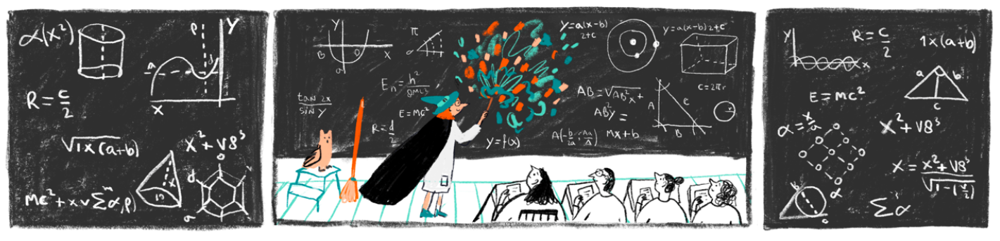

{: style="width: 100%;"}

We are thrilled to announce that registration is now open for the second workshop of the Paul Meehl Graduate School. Noah van Dongen will discuss the prerequisites of theory development in the morning, and we will try to develop a theory and possibly run some simulations in the afternoon. You can find more about this workshop [here](theory.md). We look forward to seeing you in Eindhoven on the 27th of March!

You can register for this workshop by completing the [registration form](https://forms.office.com/Pages/ResponsePage.aspx?id=R_J9zM5gD0qddXBM9g78ZP_Kihp-VglPgWom9gajHXdUODk4MTdZRk5UU1hIQVgxOTNCRVZCN0ZIRC4u). Please make sure to register before <ins>**March 1st**</ins>. Priority will be given to those who are members at Paul Meehl Graduate School. If you wish to become a member, please check the membership criteria on this [page](membership.md).

You can also join our mailing list from now on by filling in [this form](https://forms.office.com/Pages/ResponsePage.aspx?id=R_J9zM5gD0qddXBM9g78ZP_Kihp-VglPgWom9gajHXdUMEI2VEZYVUkzWkdSRVBPWTZaWlgyRUZXSC4u) to receive notifications from upcoming workshops. Rest assured, members will automatically receive these notifications and do not need to join our mailing list separately.

